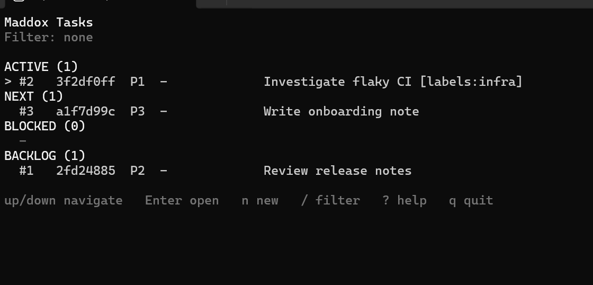
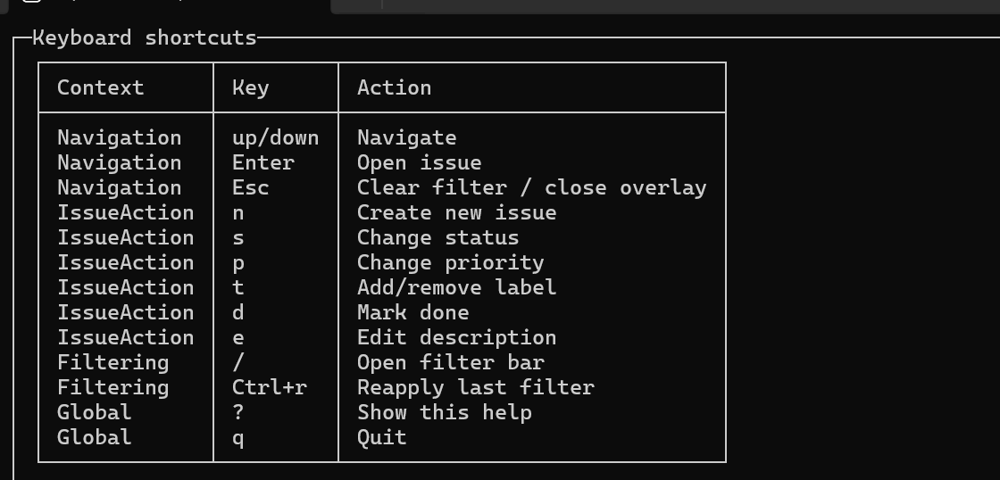

# Maddox Tasks

## Quick Start (User First)

1. Go to GitHub Releases: `https://github.com/benwmaddox/MaddoxTasks/releases/latest`
2. Download your platform zip.
3. Extract it.
4. Run the app (no parameters needed):

Windows:

```powershell
.\MaddoxTasks.exe
```

Linux/macOS:

```bash
./MaddoxTasks
```

The app reuses the same DB on every run automatically.

## One-Time Windows Install (User-Level Skills + PATH)

From this repo:

```powershell
powershell -ExecutionPolicy Bypass -File .\scripts\install.ps1
```

If you already extracted a release to another folder, still run the repo script and point it at that binary directory:

```powershell
powershell -ExecutionPolicy Bypass -File F:\Tasks\MaddoxTasks\scripts\install.ps1 -BinaryDir F:\MaddoxTasks -SkillSource F:\Tasks\MaddoxTasks\skills\maddox-tasks
```

What it does:

- Links `maddox-tasks` skill into `~/.agents/skills`, `~/.codex/skills`, and `~/.claude/skills`.
- Adds the directory containing `MaddoxTasks.exe` to your user `PATH`.

After install, open a new terminal and run:

```powershell
MaddoxTasks.exe
```

## What It Looks Like (TUI)

Main board:



Help overlay (`?`):



## Everyday CLI Commands (Released Binary)

Windows:

```powershell
.\MaddoxTasks.exe create "Fix reload bug" --priority 2 --description "Investigate cache invalidation"
.\MaddoxTasks.exe list --status Active
.\MaddoxTasks.exe status 1 Done
.\MaddoxTasks.exe label 1 architecture
.\MaddoxTasks.exe comment 1 "Waiting on security review"
.\MaddoxTasks.exe summary week
```

Linux/macOS:

```bash
./MaddoxTasks create "Fix reload bug" --priority 2 --description "Investigate cache invalidation"
./MaddoxTasks list --status Active
./MaddoxTasks status 1 Done
./MaddoxTasks label 1 architecture
./MaddoxTasks comment 1 "Waiting on security review"
./MaddoxTasks summary week
```

Issue tokens support:

- Sequence (`1`, `2`, ...)
- Full GUID
- GUID prefix

Tip: in TUI, press `Enter` on an issue to open detail view. Inside detail view, use `c` comment, `s` status, `d` description, `h` description history, and `q`/`Esc` to go back.
Comments and description history show `By` (`user`, `agent`, or a model id such as `gpt-5.2`).

## Agent JSON Commands

Windows:

```powershell
.\MaddoxTasks.exe agent issues
.\MaddoxTasks.exe agent next
.\MaddoxTasks.exe agent command --file cmd.json
.\MaddoxTasks.exe agent command --actor gpt-5.2 --file cmd.json
```

Linux/macOS:

```bash
./MaddoxTasks agent issues
./MaddoxTasks agent next
./MaddoxTasks agent command --file cmd.json
./MaddoxTasks agent command --actor gpt-5.2 --file cmd.json
```

`agent next` selection policy:
- Candidate statuses: `Active` and `Next` only.
- Sort order: `priority` ascending (`1` highest), then `Active` before `Next`, then sequence ascending.
- Output: one issue JSON object, or `null` when no candidates exist.

`cmd.json` example:

```json
{
  "type": "ChangeStatus",
  "issueId": "1",
  "newStatus": "Active"
}
```

Comment example:

```json
{
  "type": "AddComment",
  "issueId": "1",
  "comment": "Blocked by API contract review",
  "actor": "gpt-5.2"
}
```

PowerShell tip: prefer `--file` or stdin here-string over inline `--json` to avoid escaping problems.
If actor is omitted for `UpdateDescription`/`AddComment`, default resolution order is `--actor`, then env vars (`MADDOX_TASKS_AGENT_ACTOR`, `MADDOX_TASKS_ACTOR`, `CODEX_MODEL`, `OPENAI_MODEL`, `ANTHROPIC_MODEL`, `CLAUDE_MODEL`, `MODEL`), then Claude settings (`.claude/settings.local.json`, `.claude/settings.json`, `~/.claude/settings.json` model), then Codex config (`~/.codex/config.toml` model + reasoning effort), then `agent`.

## Where Data Is Stored

Default DB file is `MaddoxTasks.db`.

- Windows: `%OneDrive%\MaddoxTasks\MaddoxTasks.db` (fallback `%LOCALAPPDATA%\MaddoxTasks\MaddoxTasks.db`)
- macOS: `~/Library/Application Support/MaddoxTasks/MaddoxTasks.db`
- Linux: `$XDG_DATA_HOME/MaddoxTasks/MaddoxTasks.db` (fallback `~/.local/share/MaddoxTasks/MaddoxTasks.db`)

Override with `MaddoxTasks.json` in current directory, app directory, or OS config directory:

```json
{
  "databasePath": "D:\\Data\\MaddoxTasks.db"
}
```

Template file: `MaddoxTasks.json.example`

## How It Works (Technical, Secondary)

- Event-sourced core
- SQLite append-only event log
- Shared command pipeline for TUI, CLI, and agent JSON commands
- Spectre.Console TUI

## Source/Dev Commands

Run from source:

```bash
dotnet run
```

Build:

```bash
dotnet build
```

Test:

```bash
dotnet test .\tests\MaddoxTasks.Tests\MaddoxTasks.Tests.csproj
```

Publish single-file Native AOT (Windows default output `F:\MaddoxTasks`):

```powershell
.\scripts\publish.ps1 -Runtime win-x64
```

Publish without AOT:

```powershell
.\scripts\publish.ps1 -Runtime win-x64 -NoAot
```

## CI and Releases

- `CI` workflow runs build + tests on pushes to `main` and PRs.
- `Release` workflow publishes zipped binaries.
- Stable releases: tags matching `v*` (example: `v0.2.0`).
- Nightly prereleases: created only if code changed since the previous nightly tag.

## Agent Skill Directory

- `skills/maddox-tasks/SKILL.md`
- `skills/maddox-tasks/agents/openai.yaml`
- `skills/maddox-tasks/references/commands.md`
